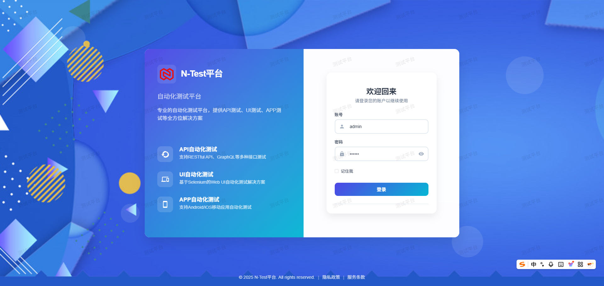
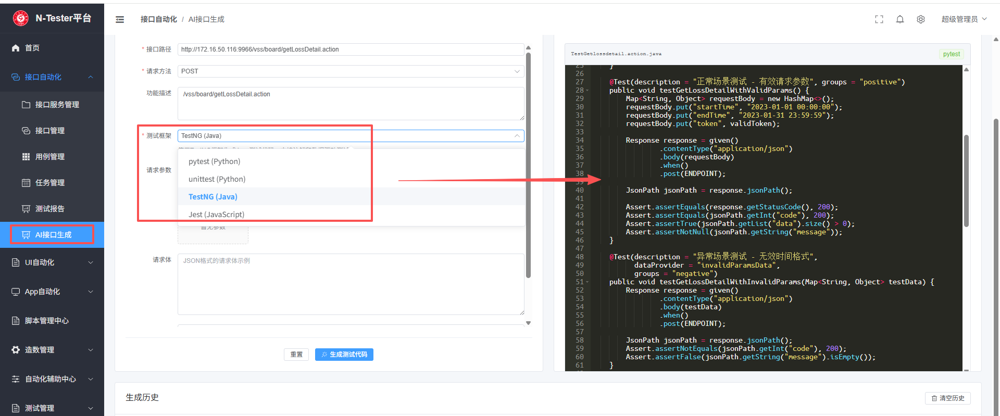
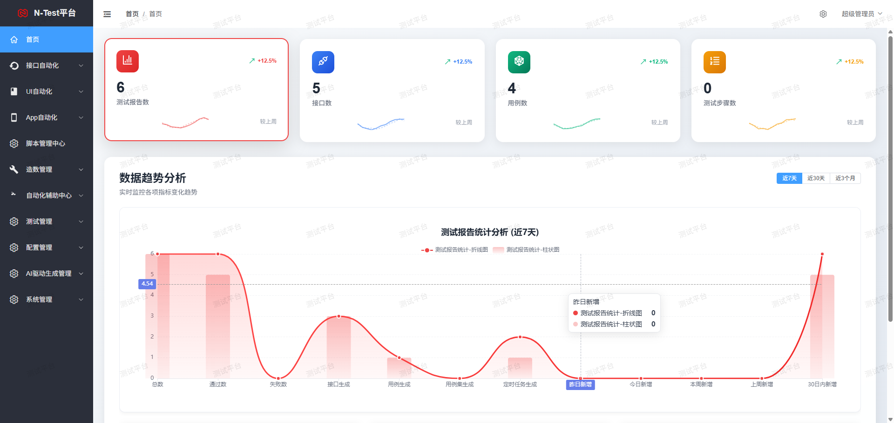
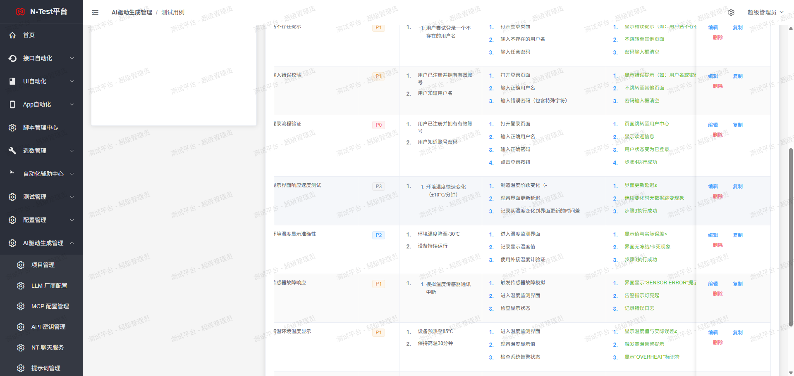
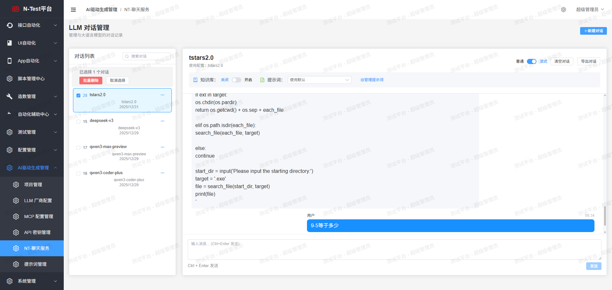
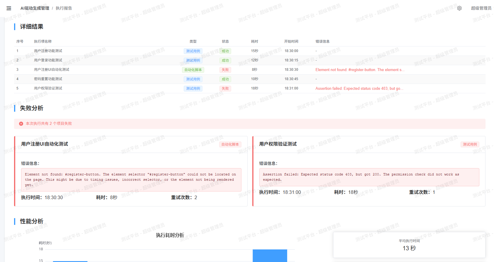

# N-Tester AI测试平台

<div align="center">


**基于AI驱动的智能化测试管理平台**

[](https://www.python.org/)
[](https://fastapi.tiangolo.com/)
[](https://vuejs.org/)
[](LICENSE)

[在线体验](http://106.54.166.76/login) | [快速开始](#README.md) | [文档](#README.md) | [文末有交流群](#backend/img/weixin/qq.png)

</div>

---

## 📖 项目介绍

N-Tester 是一款**AI驱动的智能化测试管理平台**，采用前后端分离架构，融合 Python FastAPI 后端框架和 Vue3 前端框架，提供一站式开箱即用的测试解决方案。

### 🎯 核心特性

- 🤖 **AI智能生成** - 基于大语言模型的测试用例自动生成
- 📝 **需求管理**   - 需求文档上传、拆分、评审一体化
- 🔄 **自动化测试** - 支持接口、UI、APP多种自动化测试
- 💬 **智能对话**   - AI聊天助手，实时通信
- 📊 **可视化报告** - 丰富的测试报告和数据看板
- 🔌 **MCP集成**   -  支持Model Context Protocol扩展
- 🎨 **灵活配置**  -  多LLM厂商配置，自定义提示词

---

## 🏗️ 技术架构

### 后端架构

```
backend/
├── app/
│   ├── models/              # 数据模型层
│   │   ├── system/          # 系统模型（用户、角色、权限）
│   │   └── aitestrebort/    # 业务模型目录（项目、用例、需求等）
│   ├── schemas/             # Pydantic数据验证
│   ├── routers/             # API路由层
│   │   ├── system/          # 系统路由
│   │   └── aitestrebort/    # 业务路由目录
│   ├── services/            # 业务逻辑层
│   │   ├── system/          # 系统服务
│   │   ├── aitestrebort/    # AI测试服务目录
│   │   └── ai/              # AI核心服务
│   ├── configs/             # 配置管理
│   └── utils/               # 工具类
├── migrations/              # 数据库迁移
└── logs/                    # 日志文件
```

**核心技术栈：**
- **Web框架**: FastAPI + Uvicorn
- **ORM**: Tortoise ORM
- **数据验证**: Pydantic 2.0
- **AI框架**: LangChain + LangGraph
- **向量数据库**: Qdrant
- **MCP**: FastMCP
- **数据库**: PostgreSQL / MySQL
- **认证**: JWT Token

### 前端架构

```
frontend/
├── src/
│   ├── views/               # 页面组件
│   │   ├── system/          # 系统管理页面
│   │   └── aitestrebort/    # 业务页面目录
│   ├── components/          # 公共组件
│   ├── composables/         # 组合式函数
│   ├── api/                 # API接口
│   ├── router/              # 路由配置
│   ├── stores/              # 状态管理
│   └── utils/               # 工具函数
├── public/                  # 静态资源
└── dist/                    # 构建输出
```

**核心技术栈：**
- **框架**: Vue 3 + Composition API
- **构建工具**: Vite
- **UI组件**: Element Plus
- **状态管理**: Pinia
- **路由**: Vue Router
- **HTTP客户端**: Axios
- **Markdown渲染**: Marked + Highlight.js
- **Excel导出**: XLSX

### AI技术栈

```
AI服务层
├── LLM集成
│   ├── OpenAI (GPT-3.5/4)
│   ├── Azure OpenAI
│   ├── Anthropic (Claude)
│   ├── Google (Gemini)
│   └── Ollama (本地部署)
├── 向量存储
│   ├── Qdrant
│   └── 嵌入模型 (OpenAI/Azure/Ollama)
├── RAG检索
│   ├── 文档解析
│   ├── 向量化
│   └── 语义检索
└── Agent编排
    ├── LangGraph工作流
    ├── 工具调用
    └── 状态管理
```

---

## 🚀 功能模块

### 1. 项目管理

#### 1.1 项目基础管理
- ✅ 项目创建、编辑、删除
- ✅ 项目成员管理
- ✅ 项目权限控制
- ✅ 项目统计看板

#### 1.2 LLM配置管理
- ✅ 多LLM厂商配置（OpenAI、Azure、Claude、Gemini、Ollama）
- ✅ 模型参数配置（温度、最大Token等）
- ✅ API密钥管理
- ✅ 连接测试验证

#### 1.3 MCP配置管理
- ✅ MCP服务器配置
- ✅ 传输协议支持（HTTP、SSE、WebSocket）
- ✅ 工具发现和调用
- ✅ 连接状态监控

---

### 2. 测试用例管理

#### 2.1 用例基础功能
- ✅ 用例创建、编辑、删除
- ✅ 用例模块化管理（树形结构）
- ✅ 用例等级划分（P0-P3）
- ✅ 测试步骤管理
- ✅ 前置条件和预期结果
- ✅ Markdown格式支持

#### 2.2 AI用例生成
- ✅ **在线AI生成** - 基于需求描述实时生成
- ✅ **离线AI生成** - 批量生成并预览
- ✅ 生成用例预览和编辑
- ✅ 一键保存到指定模块
- ✅ 支持多种生成策略

#### 2.3 用例导入导出
- ✅ Excel格式导出
- ✅ XMind格式导出
- ✅ 批量导入
- ✅ 模板下载

---

### 3. 需求管理

#### 3.1 需求文档管理
- ✅ 需求文档上传（Word、PDF、Markdown）
- ✅ 在线需求编辑
- ✅ 需求版本管理
- ✅ 需求状态跟踪

#### 3.2 AI需求分析
- ✅ **需求拆分** - AI自动拆分需求为功能点
- ✅ **需求评审** - AI智能评审需求质量
- ✅ **需求检索** - 基于RAG的语义检索
- ✅ **用例生成** - 基于拆分需求生成测试用例

#### 3.3 需求模块化
- ✅ 需求模块树形管理
- ✅ 需求关联测试用例
- ✅ 需求覆盖率统计

---

### 4. 自动化测试

#### 4.1 接口自动化
- ✅ **AI脚本生成** - 一键生成接口测试脚本
- ✅ 支持多种框架（Pytest、Unittest、TestNG）
- ✅ 接口用例管理
- ✅ 环境变量配置
- ✅ 断言规则配置

#### 4.2 UI自动化
- ✅ Playwright代码生成
- ✅ Selenium脚本支持
- ✅ 页面元素管理
- ✅ 录制回放功能

#### 4.3 APP自动化
- ✅ Appium集成
- ✅ 设备管理
- ✅ 用例执行

#### 4.4 脚本执行
- ✅ 本地执行
- ✅ 远程执行
- ✅ 定时任务
- ✅ 并发执行

---

### 5. AI智能助手

#### 5.1 AI聊天助手
- ✅ **实时对话** -  实时通信
- ✅ **流式响应** -  流式输出
- ✅ **上下文管理** - 智能上下文压缩和记忆
- ✅ **Markdown渲染** - 支持代码高亮和格式化
- ✅ **对话历史** - 对话记录保存和查询

#### 5.2 Agent智能执行
- ✅ 工具调用能力
- ✅ 多步骤推理
- ✅ 状态管理
- ✅ 错误处理和重试

---

### 6. 知识库管理

#### 6.1 知识库基础
- ✅ 知识库创建和管理
- ✅ 文档上传（多格式支持）
- ✅ 文档分块和向量化
- ✅ 知识库配置

#### 6.2 RAG检索
- ✅ 语义检索
- ✅ 混合检索（向量+关键词）
- ✅ 检索结果排序
- ✅ 上下文增强

#### 6.3 知识库应用
- ✅ 基于知识库的问答
- ✅ 知识库辅助用例生成
- ✅ 需求文档检索

---

### 7. 测试执行与报告

#### 7.1 测试执行
- ✅ 测试套件管理
- ✅ 执行计划配置
- ✅ 实时执行监控
- ✅ 执行进度跟踪

#### 7.2 测试报告
- ✅ **可视化报告** - 丰富的图表展示
- ✅ **执行详情** - 详细的步骤记录
- ✅ **失败分析** - 失败原因统计
- ✅ **趋势分析** - 历史数据对比
- ✅ **报告导出** - HTML/PDF格式

#### 7.3 数据看板
- ✅ 项目概览
- ✅ 用例统计
- ✅ 执行趋势
- ✅ 质量指标

---

### 8. 系统管理

#### 8.1 用户管理
- ✅ 用户创建、编辑、删除
- ✅ 用户角色分配
- ✅ 密码管理
- ✅ 用户状态控制

#### 8.2 角色权限
- ✅ 角色管理
- ✅ 权限配置
- ✅ 角色继承
- ✅ API权限控制

#### 8.3 业务线管理
- ✅ 业务线创建
- ✅ 用户业务线绑定
- ✅ 数据隔离

#### 8.4 全局配置
- ✅ 系统参数配置
- ✅ 提示词模板管理
- ✅ API密钥管理
- ✅ Webhook配置

---

## 🎨 界面展示

### 登录页面


### AI接口自动化代码生成


### 测试执行进度


### AI用例生成效果


### 智能对话页面


### 自动执行脚本用例页面


---

## 🚀 快速启动

### 环境要求

- **Python**: 3.11+
- **Node.js**: 18+
- **数据库**: MySQL 8.0+ 或 PostgreSQL 13+
- **向量数据库**: Qdrant (可选)

### 在线体验

🌐 **体验地址**: http://106.54.166.76/login

```
用户名: admin
密码: 123456
```

> ⚠️ 注意：请勿修改密码，这是共享的演示账号

---

## 📦 部署方式

### 方式一：Docker一键部署（推荐）

#### Linux/Mac
```bash
./start-docker.sh
# 或者
cd /ntest
docker compose up -d --build
```

#### Windows
```bash
start-docker.bat
```

详细说明请查看：[DOCKER.md](DOCKER.md)

---

### 方式二：一键部署脚本（推荐新手）

#### Linux/Mac
```bash
cd backend
chmod +x deploy.sh
./deploy.sh
```

#### Windows
```bash
cd backend
./deploy.bat
```

---

### 方式三：源码部署

#### 1. 创建数据库

```sql
-- MySQL
CREATE DATABASE test_platform CHARACTER SET utf8mb4 COLLATE utf8mb4_unicode_ci;

-- 设置最大连接数
SET GLOBAL max_connections=16384;

-- PostgreSQL
CREATE DATABASE test_platform ENCODING 'UTF8';
```
## ⚙️ 配置说明

### 数据库配置

cp .env.example .env 编辑 `.env` 文件：

```bash
# MySQL 配置
DB_TYPE=mysql
DB_HOST=localhost
DB_PORT=3306
DB_USER=root
DB_PASSWORD=your_password
DB_NAME=test_platform

# PostgreSQL 配置
# DB_TYPE=postgresql
# DB_HOST=localhost
# DB_PORT=5432
# DB_USER=postgres
# DB_PASSWORD=your_password
# DB_NAME=test_platform
```
#### 2. 后端部署

```bash
cd backend

# 创建虚拟环境
python -m venv .venv

# 激活虚拟环境
# Windows
.venv\Scripts\activate
# Linux/Mac
source .venv/bin/activate

# 安装依赖
pip install -r requirements.txt

# 配置环境变量
cp .env.example .env
# 编辑 .env 文件，配置数据库连接信息

# 初始化数据库
python -m aerich init -t app.configs.config.tortoise_orm_conf
python -m aerich init-db
python db_manager.py setup

# 启动服务
python main.py
# 或使用 uvicorn
uvicorn main:app --host 0.0.0.0 --port 8018 --reload

# 启动接口自动化，APP自动化，UI自动化定时任务器
python -m scheduledtask.job
```

#### 3. 前端部署

```bash
cd frontend

# 安装依赖
npm install

# 开发环境
npm run dev

# 生产环境
npm run build
```

#### 4. 访问应用

- **前端**: http://localhost:8016
- **后端API**: http://localhost:8018
- **API文档**: http://localhost:8018/docs

---


### AI配置

```bash
# OpenAI配置
OPENAI_API_KEY=sk-your-key-here
OPENAI_BASE_URL=https://api.openai.com/v1

# Azure OpenAI配置
AZURE_OPENAI_API_KEY=your-azure-key
AZURE_OPENAI_ENDPOINT=https://your-resource.openai.azure.com/
AZURE_OPENAI_API_VERSION=2024-02-15-preview
```

### 向量数据库配置

```bash
# Qdrant配置
QDRANT_HOST=localhost
QDRANT_PORT=6333
QDRANT_API_KEY=your-qdrant-key
```

---

## 🔄 数据库切换

### 使用切换脚本

```bash
# 切换到 MySQL
python switch_database.py mysql

# 切换到 PostgreSQL
python switch_database.py postgresql
```

### 数据库迁移

```bash
# 首次初始化
python -m aerich init -t app.configs.config.tortoise_orm_conf
python -m aerich init-db
python db_manager.py setup

# 模型变更后
python -m aerich migrate --name "描述"
python -m aerich upgrade

# 或使用数据库管理器
python db_manager.py migrate
python db_manager.py upgrade
```

---

## 🎯 使用指南

### 1. 创建项目

1. 登录系统
2. 进入"项目管理"
3. 点击"新建项目"
4. 填写项目信息并保存

### 2. 配置LLM

1. 进入项目详情
2. 点击"LLM配置"
3. 添加LLM配置（OpenAI、Azure等）
4. 测试连接并保存

### 3. AI生成测试用例

1. 进入"测试用例"页面
2. 点击"AI用例生成"
3. 选择生成模式（在线/离线）
4. 输入需求描述
5. 选择LLM配置
6. 点击"生成"
7. 预览并保存用例

### 4. 需求管理

1. 进入"需求管理"
2. 上传需求文档或在线编辑
3. 使用AI进行需求拆分
4. 基于拆分结果生成测试用例
5. 进行需求评审

### 5. 自动化测试

1. 进入"自动化脚本"
2. 选择测试用例
3. 点击"生成脚本"
4. 选择框架类型（Pytest/Unittest等）
5. 下载或直接执行脚本

### 6. AI聊天助手

1. 点击左侧菜单"AI聊天助手"
2. 输入问题或需求
3. AI实时响应并提供建议
4. 支持代码生成、问题解答等

---

## 🛠️ 开发指南

### 代码风格

- Python: 遵循 PEP 8 规范，使用 Black 格式化
- TypeScript: 使用 ESLint + Prettier
- 提交信息: 遵循 Conventional Commits

### 项目结构

```
N-Tester/
├── backend/                 # 后端服务
│   ├── app/                 # 应用代码
│   ├── migrations/          # 数据库迁移
│   ├── logs/                # 日志文件
│   ├── requirements.txt     # Python依赖
│   └── main.py              # 入口文件
├── frontend/                # 前端应用
│   ├── src/                 # 源代码
│   ├── public/              # 静态资源
│   └── package.json         # Node依赖
├── docker-compose.yml       # Docker编排
├── .env.example             # 环境变量模板
└── README.md                # 项目文档
```

### API开发

1. 在 `app/models/` 定义数据模型
2. 在 `app/schemas/` 定义请求/响应模型
3. 在 `app/services/` 实现业务逻辑
4. 在 `app/routers/` 定义API路由
5. 使用 `@router.add_get_route` 等装饰器添加路由

### 前端开发

1. 在 `src/views/` 创建页面组件
2. 在 `src/api/` 定义API接口
3. 在 `src/router/` 配置路由
4. 使用 Composition API 编写组件逻辑

---

## 🐛 常见问题

### 1. 端口被占用

```bash
# Windows
netstat -ano | findstr :8018
taskkill /PID <进程ID> /F

# Linux/Mac
lsof -ti:8018 | xargs kill -9
```

### 2. 数据库连接失败

- 确认数据库服务正在运行
- 检查 `.env` 中的数据库配置
- 确认数据库已创建

### 3. 依赖安装失败

```bash
# 使用国内镜像
pip install -r requirements.txt -i https://pypi.tuna.tsinghua.edu.cn/simple
npm install --registry=https://registry.npmmirror.com
```

### 4. AI功能无法使用

- 检查LLM配置是否正确
- 确认API密钥有效
- 检查网络连接

---

## 🚀 生产部署

### 使用Gunicorn

```bash
gunicorn main:app -c gunicorn_config_main.py
```

### 使用Nginx反向代理

```nginx
server {
    listen 80;
    server_name your-domain.com;

    # 前端
    location / {
        root /path/to/frontend/dist;
        try_files $uri $uri/ /index.html;
    }

    # 后端API
    location /api {
        proxy_pass http://localhost:8018;
        proxy_set_header Host $host;
        proxy_set_header X-Real-IP $remote_addr;
        proxy_set_header X-Forwarded-For $proxy_add_x_forwarded_for;
    }

    # WebSocket
    location /ws {
        proxy_pass http://localhost:8018;
        proxy_http_version 1.1;
        proxy_set_header Upgrade $http_upgrade;
        proxy_set_header Connection "upgrade";
    }
}
```

---

## 📚 文档

- [API文档](http://localhost:8018/docs)
- [Docker部署](DOCKER.md)

---

## 🤝 贡献

欢迎贡献代码、提出问题和建议！

1. Fork 本仓库
2. 创建特性分支 (`git checkout -b feature/AmazingFeature`)
3. 提交更改 (`git commit -m 'Add some AmazingFeature'`)
4. 推送到分支 (`git push origin feature/AmazingFeature`)
5. 开启 Pull Request

---

## 📞 获取帮助

### 交流群

**QQ群**: 1074327520


### 打赏作者，请作者喝咖啡，您的鼓励是对作者更新最大的动力！


### 添加作者微信进入微信群

**添加备注**: N-Tester


### 问题反馈

如遇到问题，请：
1. 查看日志文件 `logs/`
2. 查看相关文档
3. 在 GitHub 提交 Issue

---

## ⭐ Star History

如果这个项目对你有帮助，请点击 Star 支持一下！

---

## 📄 许可证

本项目采用 MIT 许可证 - 详见 [LICENSE](LICENSE) 文件

---

## 🙏 致谢

感谢以下开源项目：

- [FastAPI](https://fastapi.tiangolo.com/)
- [Vue.js](https://vuejs.org/)
- [LangChain](https://www.langchain.com/)
- [Element Plus](https://element-plus.org/)
- [Tortoise ORM](https://tortoise.github.io/)

---

<div align="center">

**最后更新**: 2026-01-29  
**版本**: 1.0.0

Made with ❤️ by N-Tester Team

</div>
=======
# AI全栈测试平台1.0版本

#### 介绍
基于Fastapi+vue3实现的全栈测试平台，集接口接口自动化，APP自动化，UI自动化

#### 软件架构
软件架构说明


#### 安装教程

1.  xxxx
2.  xxxx
3.  xxxx

#### 使用说明

1.  xxxx
2.  xxxx
3.  xxxx

#### 参与贡献

1.  Fork 本仓库
2.  新建 Feat_xxx 分支
3.  提交代码
4.  新建 Pull Request


#### 特技

1.  使用 Readme\_XXX.md 来支持不同的语言，例如 Readme\_en.md, Readme\_zh.md
2.  Gitee 官方博客 [blog.gitee.com](https://blog.gitee.com)
3.  你可以 [https://gitee.com/explore](https://gitee.com/explore) 这个地址来了解 Gitee 上的优秀开源项目
4.  [GVP](https://gitee.com/gvp) 全称是 Gitee 最有价值开源项目，是综合评定出的优秀开源项目
5.  Gitee 官方提供的使用手册 [https://gitee.com/help](https://gitee.com/help)
6.  Gitee 封面人物是一档用来展示 Gitee 会员风采的栏目 [https://gitee.com/gitee-stars/](https://gitee.com/gitee-stars/)
>>>>>>> 81c120ed9c7018dafc2928dd6474f6468cb213b9
